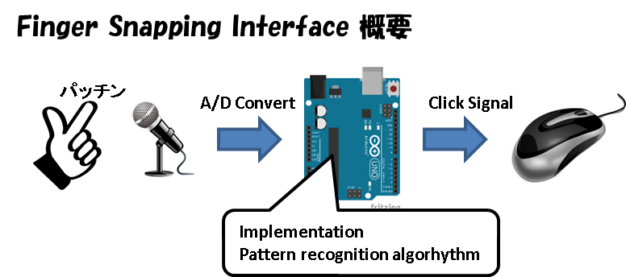
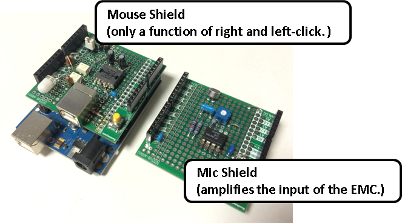

ProjectFingerSnappingInterface
==============================

## Aim（狙い）

マイコン（Arduino etc）に機械学習といったパターン認識技術を実装し、ちょっと賢い・面白いガジェットが出来ないだろうか。

IoTって言葉があるけれどモノがネットにつながってセンサーの値を送るだけではないと思う。もう少し、踏み込んだデータを送れないだろうか。

## 概要

指パッチンでマウスのクリックを行うだけの装置

## システム構成

## 実物

