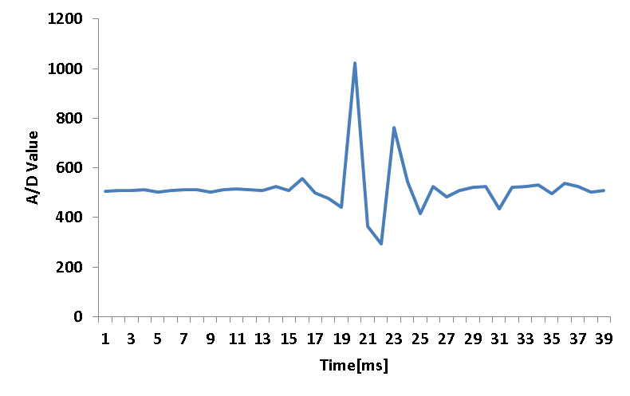

ProjectFingerSnappingInterface
==============================

## Aim（プロジェクトの狙い）

マイコン（Arduino etc）に機械学習といったパターン認識技術を実装し、ちょっと賢い・面白いガジェットが出来ないだろうか。

IoTって言葉があるけれどモノがネットにつながってセンサーの値を送るだけではないと思う。もう少し、踏み込んだデータを送れないだろうか。

## 概要

指パッチンでマウスのクリックを行うだけの装置

## システム構成

## 実物

### Mouse Shield

マウスの右クリックと、左クリックのみが出来るシールド。

秋葉原で売っていた500円くらいの光学マウスを分解し、Arduinoの信号をフォトリレーでON/OFFを制御している。

### Mic Shield

コンデンサマイクの出力をLMC662で反転増幅しているだけのシールド。Arduinoの5Vを分圧して0～5Vくらいに収まるようにしています。

## 仕組み

Mic Shieldからの出力をA/D変換し、指パッチンの波形と相関係数を求め、ある値（r=0.7）が超えた時、Mouse Shieldの左クリック入力にHighを出力するようになっています。

Timer2の割り込みで1[ms]毎にA/D変換していますが、計算が間に合っていないように思います。

## MISC

* 指パッチンの波形（1[kHz]でサンプリング）

# Related work
* [素晴らしきヒィッツカラルド](http://ja.wikipedia.org/wiki/%E3%82%B8%E3%83%A3%E3%82%A4%E3%82%A2%E3%83%B3%E3%83%88%E3%83%AD%E3%83%9C_THE_ANIMATION_-%E5%9C%B0%E7%90%83%E3%81%8C%E9%9D%99%E6%AD%A2%E3%81%99%E3%82%8B%E6%97%A5%E3%81%AE%E7%99%BB%E5%A0%B4%E4%BA%BA%E7%89%A9 "素晴らしきヒィッツカラルド")

